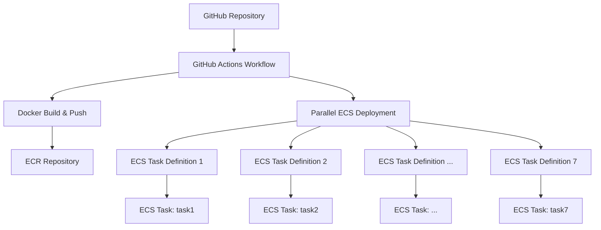

# 設計書

## 概要

GoとCobraフレームワークを使用したマイクロサービスシステムの設計です。7つの番号付きタスクコマンド（task1-task7）を提供し、各コマンドは個別のAWS ECSタスクとしてデプロイ可能です。GitHub Actionsを使用して並列デプロイメントを実現します。

## アーキテクチャ

### システム全体構成



### アプリケーション構成

```mermaid
graph TB
    A[main.go] --> B[cmd/root.go]
    B --> C[task1 Command]
    B --> D[task2 Command]
    B --> E[task3 Command]
    B --> F[task4 Command]
    B --> G[task5 Command]
    B --> H[task6 Command]
    B --> I[task7 Command]
    
    C --> J[Log: "this is task1!"]
    D --> K[Log: "this is task2!"]
    E --> L[Log: "this is task3!"]
    F --> M[Log: "this is task4!"]
    G --> N[Log: "this is task5!"]
    H --> O[Log: "this is task6!"]
    I --> P[Log: "this is task7!"]
```

## コンポーネントと インターフェース

### 1. Go CLI アプリケーション

#### ディレクトリ構造
```
micro-services/
├── cmd/
│   └── root.go          # Cobraルートコマンドとサブコマンド定義
├── internal/            # 内部パッケージ（将来の拡張用）
├── task_definitions/    # ECSタスク定義ファイル
│   ├── task1.json
│   ├── task2.json
│   ├── task3.json
│   ├── task4.json
│   ├── task5.json
│   ├── task6.json
│   └── task7.json
├── Dockerfile          # マルチステージDockerビルド
├── go.mod             # Goモジュール定義
├── go.sum             # 依存関係チェックサム
└── main.go            # エントリーポイント
```

#### コマンド構造
- **ルートコマンド**: アプリケーションのメインエントリーポイント
- **サブコマンド**: task1, task2, task3, task4, task5, task6, task7
- **各サブコマンド**: 対応するログメッセージを出力して終了

### 2. Docker コンテナ

#### マルチステージビルド設計
1. **ビルドステージ**: Go アプリケーションをコンパイル
2. **実行ステージ**: 軽量なベースイメージで実行バイナリのみを含む

#### コンテナ実行方式
- コンテナ起動時にコマンドライン引数でタスクを指定
- 例: `docker run microservice task1`

### 3. AWS ECS タスク定義

#### タスク定義の構成要素
- **Family**: `microservice-task[1-7]`
- **Task Role**: ECS実行に必要な権限
- **Execution Role**: ECRからのイメージプル権限
- **Container Definition**: 
  - Image: ECRリポジトリのイメージ
  - Command: 対応するタスクコマンド
  - CPU/Memory: 適切なリソース配分
  - Logging: CloudWatch Logsへの出力

#### リソース配分
- **CPU**: 256 CPU units (0.25 vCPU)
- **Memory**: 512 MB
- **Network Mode**: awsvpc

### 4. GitHub Actions ワークフロー

#### ワークフロー構成
1. **トリガー**: push to main branch, manual dispatch
2. **ジョブ1**: Docker Build & Push
3. **ジョブ2**: Parallel ECS Deployment (7つのタスク定義)

#### 並列デプロイメント戦略
- Matrix strategy を使用して7つのタスク定義を並列処理
- 各タスク定義のデプロイメントは独立して実行
- 失敗した場合でも他のデプロイメントは継続

## データモデル

### コマンド実行ログ
```go
type TaskExecution struct {
    TaskName    string    `json:"task_name"`
    Message     string    `json:"message"`
    Timestamp   time.Time `json:"timestamp"`
    Status      string    `json:"status"`
}
```

### ECS タスク定義構造
```json
{
  "family": "microservice-task1",
  "taskRoleArn": "arn:aws:iam::ACCOUNT:role/ecsTaskRole",
  "executionRoleArn": "arn:aws:iam::ACCOUNT:role/ecsTaskExecutionRole",
  "networkMode": "awsvpc",
  "requiresCompatibilities": ["FARGATE"],
  "cpu": "256",
  "memory": "512",
  "containerDefinitions": [
    {
      "name": "microservice-container",
      "image": "ACCOUNT.dkr.ecr.REGION.amazonaws.com/microservice:latest",
      "command": ["task1"],
      "essential": true,
      "logConfiguration": {
        "logDriver": "awslogs",
        "options": {
          "awslogs-group": "/ecs/microservice",
          "awslogs-region": "REGION",
          "awslogs-stream-prefix": "ecs"
        }
      }
    }
  ]
}
```

## エラー処理

### CLI コマンドレベル
1. **コマンド解析エラー**: Cobraが自動的に処理
2. **実行時エラー**: 構造化されたエラーメッセージをstderrに出力
3. **終了コード**: 成功時は0、エラー時は1

### コンテナレベル
1. **起動エラー**: コンテナが適切な終了コードで終了
2. **リソース不足**: ECSがタスクを再試行
3. **ネットワークエラー**: CloudWatch Logsに記録

### デプロイメントレベル
1. **Docker ビルドエラー**: GitHub Actionsワークフローが失敗
2. **ECR プッシュエラー**: 認証情報とネットワークの確認
3. **ECS デプロイエラー**: 個別タスク定義の失敗を報告


## セキュリティ考慮事項

### 認証情報管理
1. **GitHub Secrets**: AWS認証情報の安全な保存
2. **IAM ロール**: 最小権限の原則に基づく権限設定
3. **ECR 認証**: トークンベースの認証

### コンテナセキュリティ
1. **ベースイメージ**: 最新の軽量で安全なイメージを使用
2. **非rootユーザー**: コンテナ内での非特権実行
3. **脆弱性スキャン**: 定期的なイメージスキャン

### ネットワークセキュリティ
1. **VPC 設定**: プライベートサブネットでのタスク実行
2. **セキュリティグループ**: 必要最小限の通信のみ許可
3. **暗号化**: 転送時および保存時の暗号化

## パフォーマンス考慮事項

### リソース最適化
1. **CPU/Memory**: タスクの性質に応じた適切な配分
2. **コンテナサイズ**: マルチステージビルドによる最小化
3. **起動時間**: 軽量なベースイメージによる高速起動

### スケーラビリティ
1. **並列実行**: 複数タスクの同時実行サポート
2. **オートスケーリング**: 需要に応じたタスク数の調整
3. **リソース監視**: CloudWatch メトリクスによる監視

### 監視とログ
1. **CloudWatch Logs**: 構造化されたログ出力
2. **メトリクス**: タスク実行時間と成功率の監視
3. **アラート**: 異常な動作の早期検出